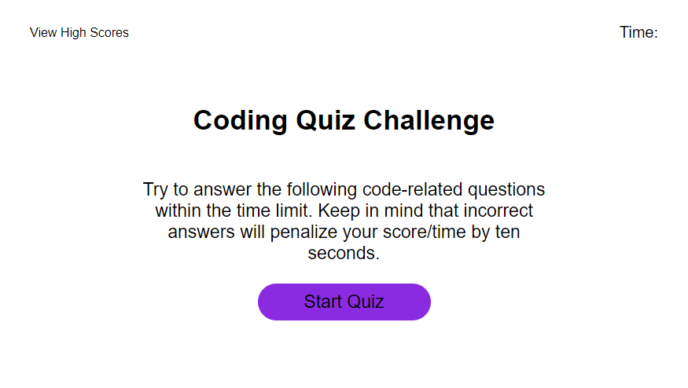

# js-code-quiz-app

## Description
A Quiz Web App developed using HTML, CSS, and Javascript. I created this project to improve my javascript coding ability.

## Usage

Try to answer the following code-related questions within the time limit. Keep in mind that incorrect answers will penalize your score/time by ten seconds.

## Credits

I take credit for designing and developing this web app.

## License

